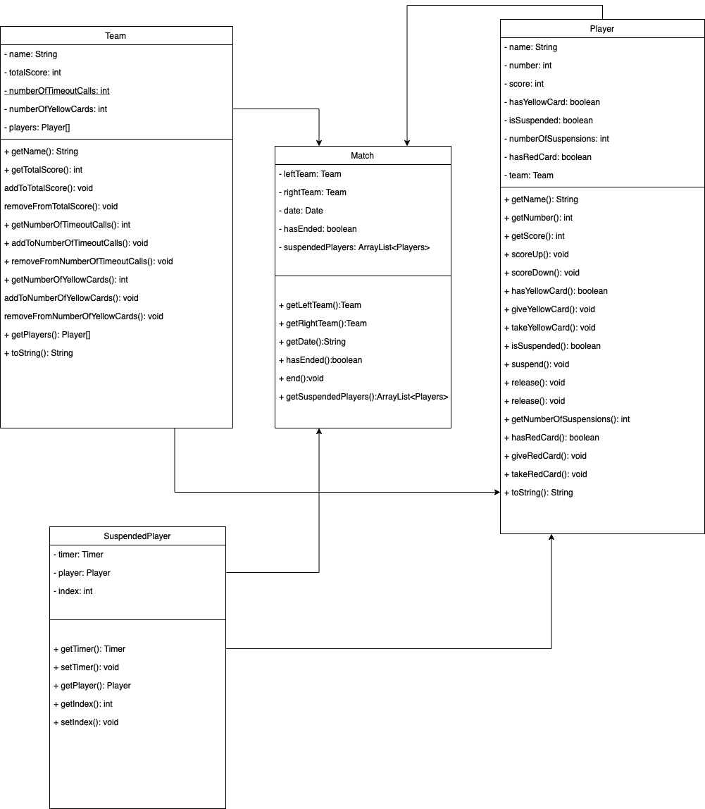

# JHandball-Table

A simple score table for the game of handball. How does it work?

From the main window, click Match->Initialize to setup the teams with players. Then hit apply.

To start the game, go to Match->Begin. From the match menu you can also show a public window to mirror the game highlights like score, timer and player list.

From the main window you can select any player and modify stats like score, yellow or red cards and suspensions. Here you can also manage the timeouts.

If a player was suspended or given a card by mistake, the move can be reverted from the Player tab. Here you can release the player from suspension, take a point from the score back or take yellow and red cards back.

A match has the following states: two halves, a break between them, timeouts and overtimes, all of them managed by a timer system and the buttons from the master window.

## UML Diagram

